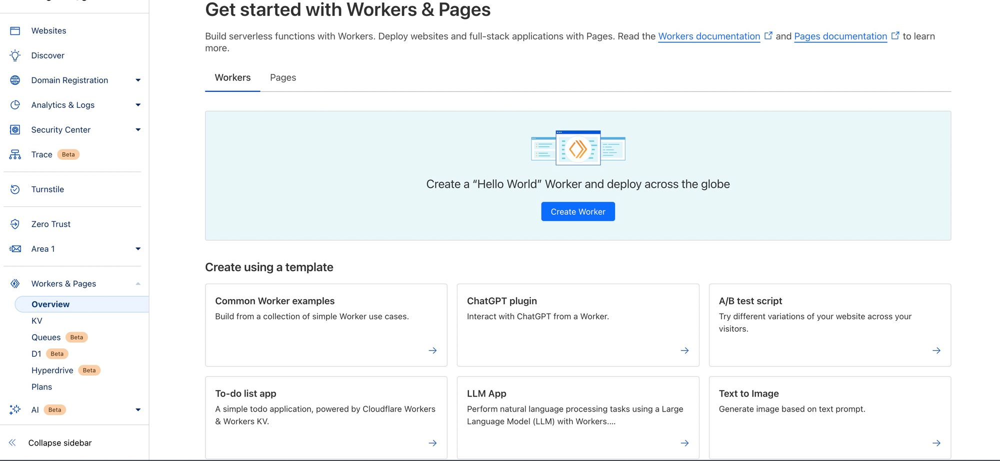

# Week 11.1 - Serverless Fns

## Contents:
- **What are backends servers?**
- **What are Serverless Backends**
- **Famous Serverless Providers**
- **When Should We use a serverless architecture?**
- **Cloudflare Worker Setup**
- **How cloudflare workers work**
- **Initializing a worker**
- **Deploying a worker**
- **Adding express to it**
- **Using hono**
- **Middlewares**
- **Connecting to DB**

### What are backends servers?
- We have used **express** to create a Backend server and the way we run it usually is **node index.js** which starts a process on a certain port(usually 3000).
- When we have to deploy the it on the internet, we usually go with any of the cloud providers like **AWS**, **GCP**, **Azure** or **Cloudflare**.
- After choosing the cloud provider of our choice, we need to rent a **VM(Virtual Machine)** and deploy our app.
- Put it in an **Auto Scaling Group**.
- Deploy it in a **Kubernetes Cluster**.
- There are few Downsides to doing this - 
    - Taking care of how/when to scale.
    - Base cost even if no one is visiting out website.
    - Monitoring various servers to make sure no server is down.

### What are Serverless Backends
- **Serverless** is a backend deployment in which the cloud provider dynamically manages the allocation and provisioning of servers. 
- The term **serverless** doesn't mean there are no servers involved, instead it means that developers and operators do not have to worry about the servers.
- An easier definition can be what if we could just write our **express routes** and run a command, that would automatically **deploy**, **autoscale** and charge us on a **per request basics** (rather than we pay for VMs)
- The problem with this approach are - 
    - More expensive at scaling
    - Cold start problem - when our server is inactive for a some period, the providers shutdown the server until a new request has been made. When a new request is recived the a new server instance will be created. the first request after a period of inactivity would take longer to recive a response and the subsequent request will have a faster response than the first.

### Famous Serverless Providers
There are many famous backend serverless providers - 
1. [AWS Lambda](https://aws.amazon.com/pm/lambda/)
2. [Google Cloud Functions](https://firebase.google.com/docs/functions)
3. [Cloudflare Workers](https://workers.cloudflare.com/)

### When should you use a serverless architecture?
1. When we have to get off the ground fast and don’t want to worry about deployments.
2. When we can’t anticipate the traffic and don’t want to worry about autoscaling.
3. If we have very low traffic and want to optimise for costs.

### Cloudflare workers setup
- Please sign up on [Cloudflare](https://cloudflare.com/)
