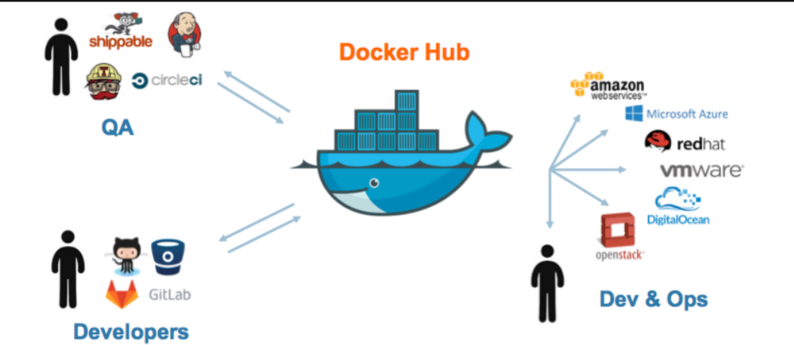

# Week 12.3 | Actionable Docker

`Note`: This a short actionable introduction to Docker. This will help us get started with running packages locally and gives us a taste of what Docker can do.

## Contents:
- [**Installation**](#installation)
- [**Verification**](#verification)
- [**Why Docker?**](#why-docker)
- [**Docker Hub**](#docker-hub)

### Installation
Docker can be installed using the Docker GUI, which simplifies the setup process. Detailed instructions for various operating systems can be found on the official Docker documentation website at https://docs.docker.com/engine/install/.

### Verification 
After installation, we should verify that Docker is installed correctly by running the `docker run hello-world` command. This command will pull the "hello-world" image from Docker Hub and run it in a new container, which should print a message to the terminal.

### Why Docker?
Docker is a powerful platform that serves several purposes in the development, deployment, and running of applications. Below are the reasons why it is used:
1. **Containerization of Applications:** 
    - Docker allows us to package our application and its dependenices into a container, which is a lightweight, standalone and executable software package.
    - This containerization ensures that the application run consistently across different computing environments from development to staging to production.
2. **Running Other People's Code and Project:**
    - With docker, we can easily run software and applications build by others without worrying about the setting up the required environment or dependenices.
    - This is because all the necessary components are included within the container.
3. **Running Common Software Packages:**
    - Docker provides the ability to run common software packages such as databases(MongoDB, Postgres, etc.) within containers.
    - This means we can quickly deploy and manage these services without the need  to install and configure them directly on out host machine.

**Note:** The use of Docker streamlines the development process, simplifies deployment, and enhances the scalability and portability of applications. It isolates applications in containers, making it easier to manage dependencies and avoid conflicts between different software running on the same system. 

### Docker Hub
Docker registries are similar to version control repositories for code, such as GitHub or GitLab, but instead of code, they store Docker images. Docker images are the blueprints for creating Docker containers, which include the application and all of its dependencies.

Docker Hub is the default registry for Docker and is analogous to GitHub in the context of Docker images. It's a cloud-based repository where users can sign up for an account, push their custom images, pull images published by others, and work with automated build workflows. 
Here's the relevance of Docker Hub in comparison to GitHub:
- **Version Control and Collaboration:** Just as GitHub allows developers to store, version, and collaborate on code, Docker Hub provides similar functionalities for Docker images. Users can keep track of different versions of their images, collaborate with team members, and integrate with continuous integration/continuous deployment (CI/CD) pipelines.
- **Public and Private Repositories:** Both platforms offer the ability to have public repositories, where anyone can access and use the resources, and private repositories, which are restricted to authorized users.
**Community and Official Images:** Docker Hub hosts a vast collection of community-generated images, similar to how GitHub hosts open-source projects. It also provides official images maintained by software vendors or the Docker team, ensuring a trusted source of commonly used software packages.
- **Automated Builds:** Docker Hub can automatically build images from source code in a repository when changes are made, similar to how CI/CD systems work with GitHub to automate the testing and deployment of code.

In summary, Docker Hub is a central repository for Docker images, where users can store, manage, and distribute their containerized applications. It plays a crucial role in the Docker ecosystem, facilitating the sharing and deployment of software in a manner that's consistent with how code is managed on platforms like GitHub.