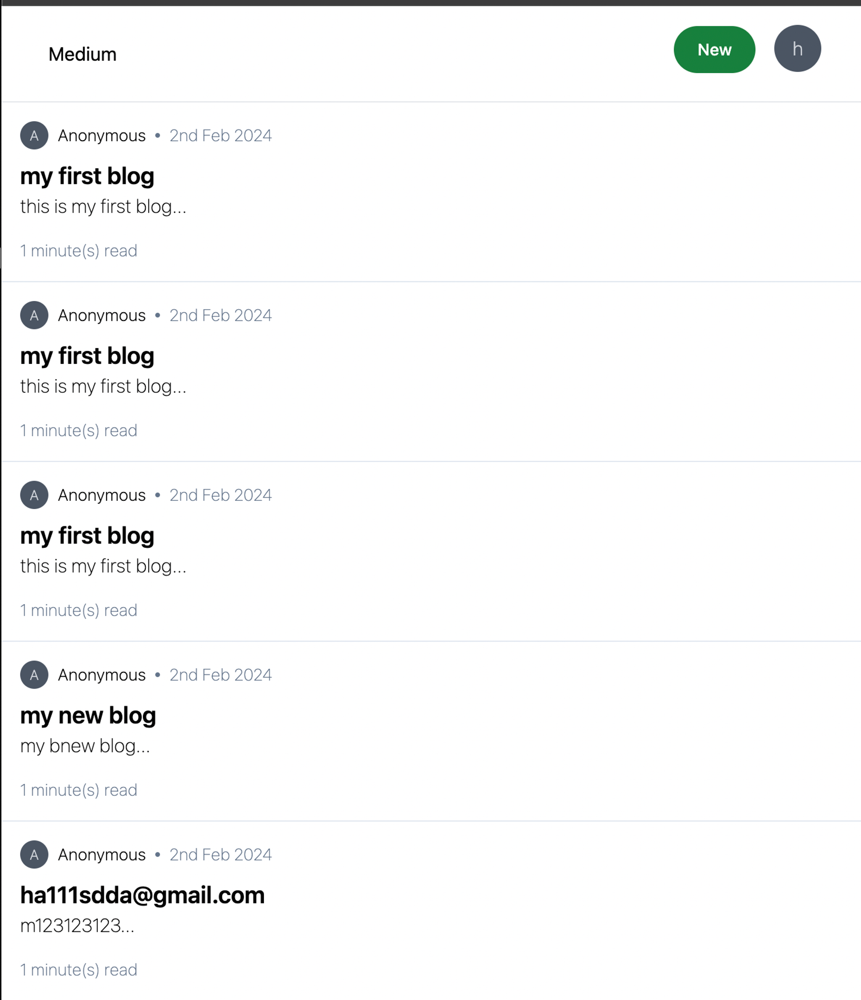
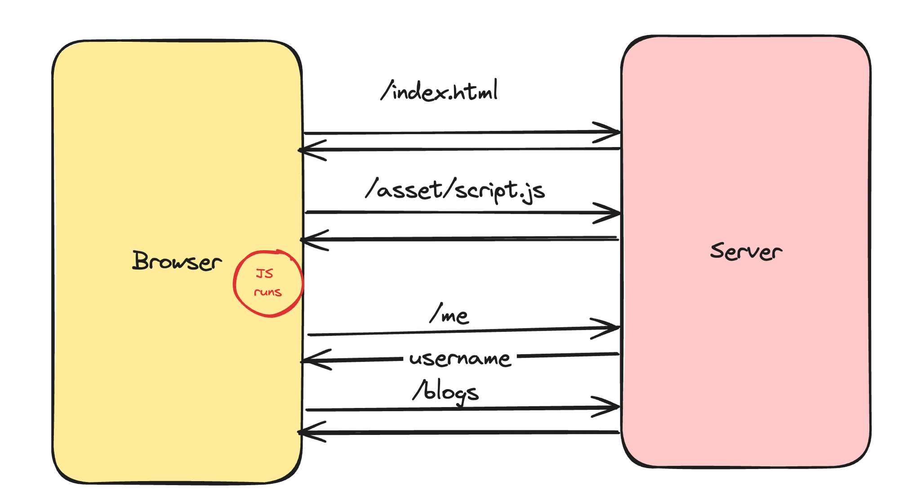

# Week 14.1 | Into to Next.js (Client Side)

## Contents:
- [**Introduction to Next.js**](#introduction-to-nextjs)
- [**Problem with React.js**](#problem-with-reactjs)
- [**SEO Optimisation**](#seo-optimisation)
- [**Waterfalling Problem**](#waterfalling-problem)

### Introduction to Next.js
- **Next.js** is a React framework for building full-stack web applications. 

### Problem with React.js
1. In React Project, we have maintain a seperate repository for backend and has to deploy seperately.
2. React does not provide out of the box routing (We had to use react-router-dom).
3. React is not SEO Optimised
4. Waterfalling Problem

### SEO Optimisation
- Google has a bunch of crawlers that hit websites and figure out what the website does.
- These crawlers ranks the website based on the HTML it gets back.
- The crawlers don't usually run JS code and renders the webpage to see the final output.
- A website build using React.js, initially has a boiler plate HTML, which gets hydrated after the react code gets rendered.
- This isn't suitable for SEO Crawlers, as the HTML they gets is just a boiler plate that does not specific any information regarding the website.
- 
- Thats where Next.js comes into picture, It also Static Site Generation(SSG) and Server Side Rendering(SSR).

# Waterfalling Problem
- The **waterfalling problem** in React, and more broadly in web development, refers to a scenario where data fetching operations are chained or dependent on each other in a way that leads to inefficient loading behavior.
- Lets assume we build a Blogging website in React

- Lets look at the request cycle -

    1. Fetching the index.html from the CDN
    2. Fetching script.js from CDN
    3. Checking if user is logged in (if not, redirect them to /login page)
    4. Fetching the actual blogs
- There are 4 round trips that happen one after the other (sequentially).
- Let see how next.js handles the above request -

- Next.js lets us get all the blogs in one request, this is great as it better for SEO optimization
