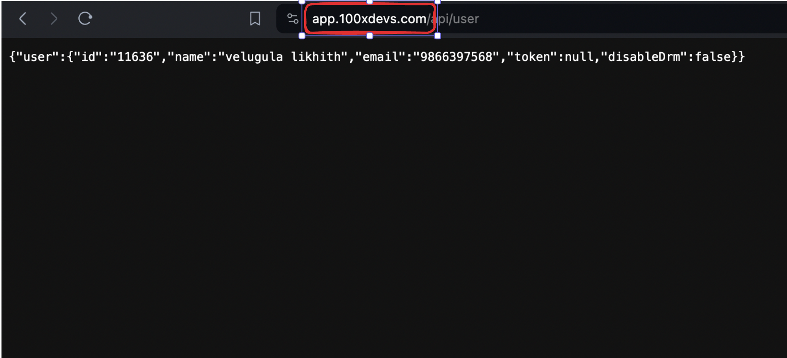
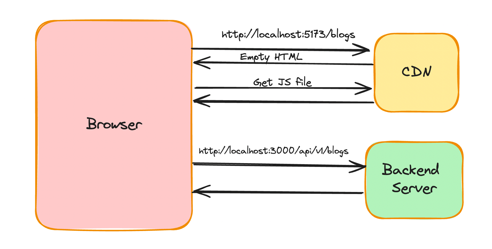
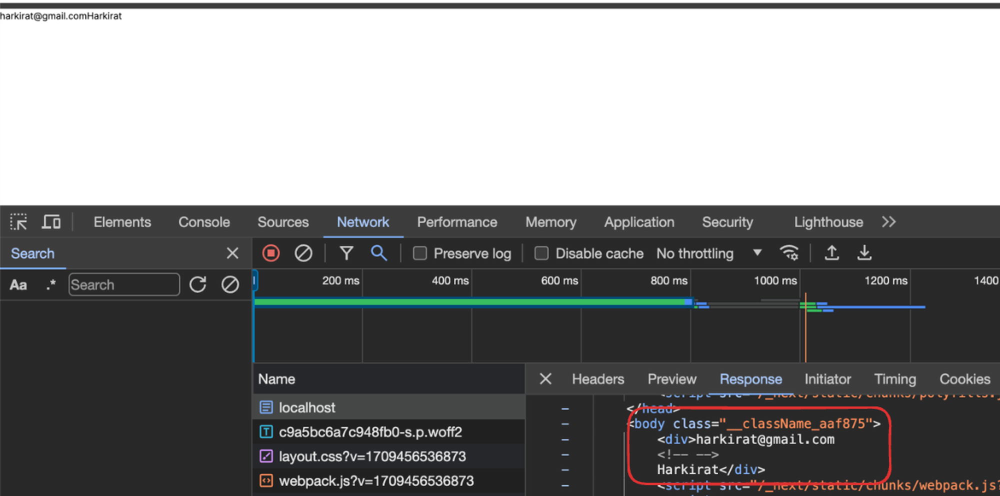

# Week 14.2 | Intro to Next.js (Server Side)

### Contents - 
- [**Backend in Next.js**](#backend-in-nextjs)
- [**Recap of data fetching in React**](#recap-of-data-fetching-in-react)
- [**Data fetching in Next**](#data-fetching-in-next)
    - [**Let try this using next.js**](#let-try-this-using-nextjs)
- [**Loaders in Next**](#loaders-in-next)


### Backend in Next.js
- Next.js is a full stack framework.
    
- This means the same server handles the frontend and backend request.
    
    
- Next.js allows us to maintain a single codebase for our application rather than maintaining seperate codebase for frontend and backend which we used to do with MERN.
- This also ensure that there are **no CORS issues**, as same domain name is for both backend and frontend.
- This also makes deployment easier, we only have to deploy a single codebase, where as on MERN, we have to deploy both frontend and backend seperately.


### Recap of data fetching in React
- This is a card website that let's a user see their name and email from the given endpoint.
    
- Now lets look at the UserCard component -
    
- Now see how to data fetching is happening on the client
    
    - First we send a request to the endpoint and get backs an empty HTML.
    - Second request is send to get the JS scripts.
    - Then the UserCard component get rendered initial with a spinner and backend request is send to the server to fetch the user details.
    - After fetching the user details it gets rendered on the client side.

### Data fetching in Next
- We could do the same way we did in React to fetch data, but we will lose the benefits of **Server Side Rendering** that Next.js offers us.
- In SSR, the user details are fetched on the server side and pre-render on the page before returning it to the client.
    

#### Let try this using next.js
1. Initialise an empty next project
    ```bash
    npx create-next-app@latest
    ```

2. Install **axios**
    ```bash
    npm i axios
    ```
3. Clean up **page.tsx**, **global.css**.
4. In the root **page.tsx**, write a function to fetch the user details
    ```js
    async function getUserDetails() {
        const response = await axios.get("https://week-13-offline.kirattechnologies.workers.dev/api/v1/user/details")
        return response.data;
    }
    ```
5. Convert the default export to be an async function (yes, nextjs now supports **async components**).
    ```jsx
    import axios from "axios";

    async function getUserDetails() {
        const response = await axios.get("https://week-13-offline.kirattechnologies.workers.dev/api/v1/user/details")
        return response.data;
    }

    export default async function Home() {
        const userData = await getUserDetails();

        return (
            <div>
                {userData.email}
                {userData.name}
            </div>
        );
    }
    ```
6. Check the network tab, make sure there is no waterfalling.
    
7. Prettify the UI
    ```jsx
    import axios from "axios";

    async function getUserDetails() {
        const response = await axios.get("https://week-13-offline.kirattechnologies.workers.dev/api/v1/user/details")
        return response.data;
    }

    export default async function Home() {
        const userData = await getUserDetails();

        return (
            <div className="flex flex-col justify-center h-screen">
                <div className="flex justify-center">
                    <div className="border p-8 rounded">
                        <div>
                            Name: {userData?.name}
                        </div>
                    
                        {userData?.email}
                    </div>
                </div>
            </div>
        );
    }
    ```

### Loaders in Next
Suppose, the **getUserDetails** call takes 5s to finish(lets sata the backend is slow). then the website will take more than 5s seconds to load on client side.
During this time we could show a loader.
```jsx
import axios from "axios";

async function getUserDetails() {
    await new Promise(r => setTimeout(r, 5000))
    const response = await axios.get("https://week-13-offline.kirattechnologies.workers.dev/api/v1/user/details")
    return response.data;
}

export default async function Home() {
    const userData = await getUserDetails();

    return (
        <div className="flex flex-col justify-center h-screen">
            <div className="flex justify-center">
                <div className="border p-8 rounded">
                    <div>
                        Name: {userData?.name}
                    </div>
                
                    {userData?.email}
                </div>
            </div>
        </div>
    );
}
```
Here we have added an artifical delay of 5s.
To add a loader or skeleton in next.js, Just like **page.tsx** and **layout.tsx** , we can define a **loading.tsx** file that will render until all the async operations finish.
```jsx
export default function Loading() {
    return (
        <div className="flex flex-col justify-center h-screen">
            <div className="flex justify-center">
                Loading...
            </div>
        </div>
    )
}
```