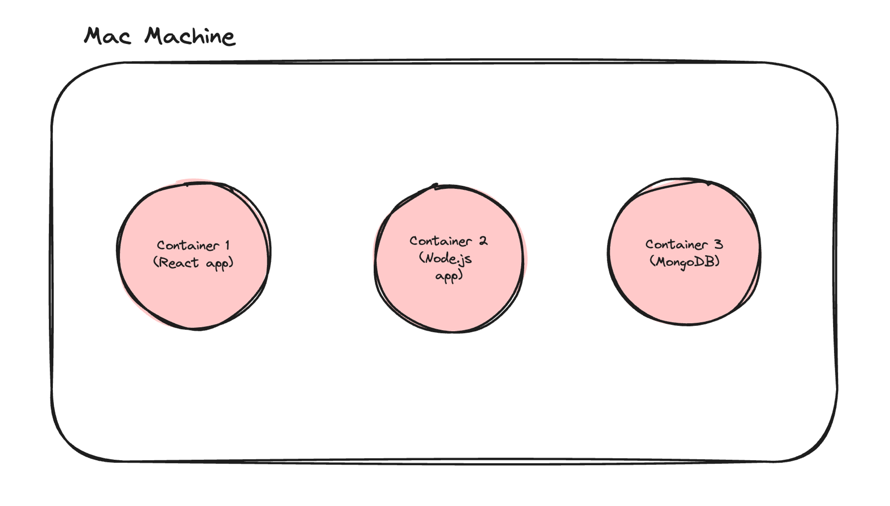

# week 15.21 | Docker Intro

## Contents:
- [**Why Docker?**](#why-docker)
- [**Containerization**](#containerization)
    - [**What are containers**](#what-are-containers)
    - [**Why containers**](#why-containers)
    - [**Benifits of using containers**](#benifits-of-using-containers)

### Why Docker?
Docker is a powerful platform that serves several purposes in the development, deployment, and running of applications. Below are the reasons why it is used:
1. **Containerization of Applications:** 
    - Docker allows us to package our application and its dependenices into a container, which is a lightweight, standalone and executable software package.
    - This containerization ensures that the application run consistently across different computing environments from development to staging to production.
2. **Running Other People's Code and Project:**
    - With docker, we can easily run software and applications build by others without worrying about the setting up the required environment or dependenices.
    - This is because all the necessary components are included within the container.
3. **Running Common Software Packages:**
    - Docker provides the ability to run common software packages such as databases(MongoDB, Postgres, etc.) within containers.
    - This means we can quickly deploy and manage these services without the need  to install and configure them directly on out host machine.

### Containerization
#### What are containers
Containers are a way to package and distribute software applications in a way that makes them easy to deploy and run consistently across different environments. They allow us to package an application, along with all its dependencies and libraries, into a single unit that can be run on any machine with a container runtime, such as Docker.

#### Why containers
Setting up a project locally isn't easy, depending on the operating system used the steps to run the projects varies. It becomes hard to keep track of dependencies as the project grows. Sometimes some of these dependencies or other softwares are already present on your system and are of different verions, this also cause issues setting up projects locally. 
That to not, event after the project gets completed most of these dependencies will still be in the system. 
That where containers comes into action, a container create an isolate environment to run the project with all the neccesary dependencies. With a single command the project is up and running regardless of the operating system you are using.

#### Benifits of using containers

- We can describe all the configurations in a single file.
- We can run our projects in an isolated environment.
- Setting projects locally a breeze and with a single command.
- Makes installing auxiliary services/DBs easy