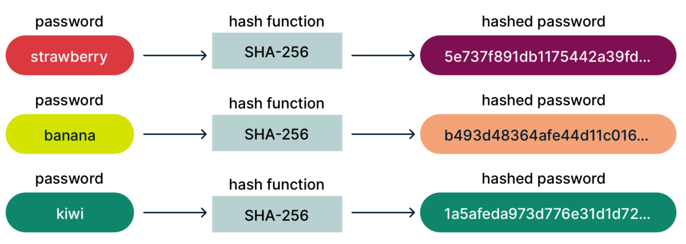

# Authentication

### Concepts to know before getting into authentication
1. Hashing
2. Encryption
3. Json Web Tokens
4. Local Storage

##### Hashing
- Hashing is a process of converting input data (often referred to as a "message") into a fixed-size string of characters, which is typically a hexadecimal or binary representation.
- The output, known as the hash value or hash code, is unique to the input data.
- Instead of storing passwords in plaintext, systems often store the hash of the password. During login, the entered password is hashed, and the hash value is compared with the stored hash.
- Common hash functions include MD5, SHA-1, and SHA-256. However, MD5 and SHA-1 are considered insecure for cryptographic purposes due to vulnerabilities, and SHA-256 is often recommended for security-sensitive applications.
- Hashing is one way, it is computationally infeasible to reverse the hash value to obtain the original input.
- For a given input it produces a unique hash value, changing the input by a bit changes the output by a lot.

{height=300px}

##### Encryption
- Encryption is the process of converting information or data into a code to prevent unauthorized access.
- It plays a crucial role in securing communication and protecting sensitive information. 
- Encryption is two way process, meaning we can decrypt the encrypted output to the original input using the key.
- There are two main types of encryption: 
    1. Symmetric Encryption: In symmetric encryption, the same key is used for both encryption and decryption.
    2. Asymmetric Encryption: Asymmetric encryption uses a pair of keys: a public key for encryption and a private key for decryption.

#### Json Web Tokens (JWT)
- Its neither encryption nor hashing it is actually a digital Signature.
- Anyone can see the original output given the signature.
- Signature can be verified using a password.
