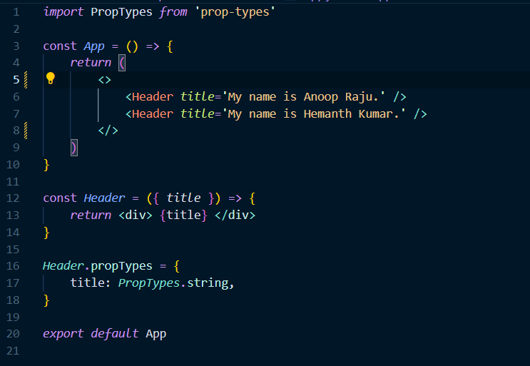
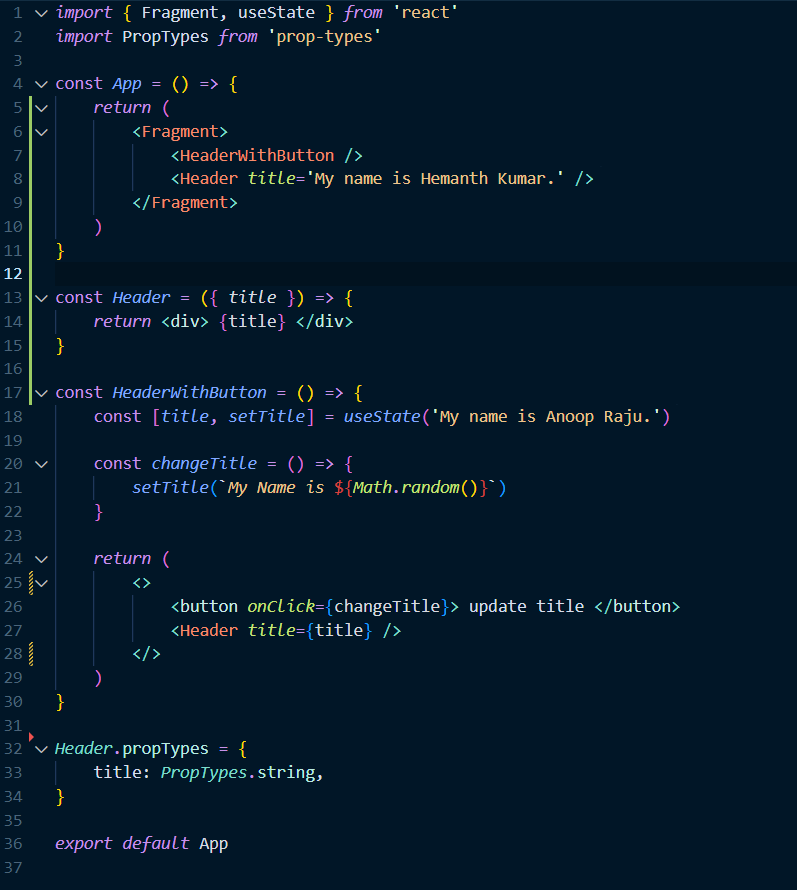
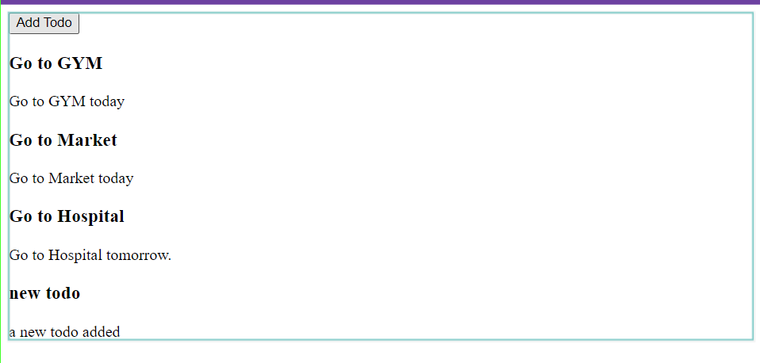

# Week 6.1 React Deeper Dive

### React Component Returns
- A Component can only return a single top level XML.
- We could contain multiple children components inside the top level XML.
- The example shown below is wrong as there are two top level XML.


- In the above scenario, we could wrap the two top level xml in a **React.Fragment (<></>)**.
- This a slightly better solution as it does not introduce an extra DOM element.


- The main reason behind a component returning a single top level XML is that, it makes react easy to do **reconciliation**.  

### What exactly is re-rendering in react?
- In React, re-rendering refers to the process of updating the user interface (UI) in response to changes in the application's state or props. 
- When the state or props of a React component change, React will re-run the component's render method to generate a new virtual DOM representation of the UI. It then compares the new virtual DOM with the previous one to identify the differences (diffing). After identifying the differences, React updates only the parts of the actual DOM that have changed, instead of re-rendering the entire UI.
- A parent component re-render triggers all children re-rendering
- React Dev Tools shows a bounding box around the components that are getting re-rendered.

### Minimize the number of re-rendering
- Here is an example, where the state is in the parent component and when the state changes the parent component along with all the children components gets re-rendered.
    
    
- When the state get moved to a child component, only that child component gets re-rendered when the state gets updated and not the parent component nor the sibling components.
    
    
- Another Solution by using **React.memo()**, this will memoize the component and only re-renders when the props or the state of the component changes.
    
    

### React.memo()
**React.memo()** is a higher-order component provided by React. It's used to memoize functional components, preventing unnecessary re-renders when the component receives the same props. Memoization helps improve the performance of React applications by avoiding rendering components if their inputs (props) haven't changed.

### Keys in React
In React **key** is a special attribute that we can include in JSX elements when we are rendering a list of items. The purpose of keys is to help React identify which items have changed, been added or been removed from a list. React uses the **keys** to optimize the rendering process and update only the necessary parts of the UI.

Here's an example of using keys in React:
``` jsx
import React, { useState } from 'react'

const Todo = () => {
    const [todos, setTodos] = useState([
		{ id: 1, title: 'Go to GYM', description: 'Go to GYM today' },
		{ id: 2, title: 'Go to Market', description: 'Go to Market today' },
		{
			id: 3,
			title: 'Go to Hospital',
			description: 'Go to Hospital tomorrow.',
		},
	])

	const addTodo = () => {
		setTodos((prev) => [
			...prev,
			{ id: prev.length, title: 'new todo', description: 'a new todo added' },
		])
	}

    return (
        <div>
			<button onClick={addTodo}> Add Todo </button>

			<ul>
            {todos.map(({ id, title, description }) => (
				<li key={id}>
					<h3> {title} </h3>
					<p> {description} </p>
				</li>
			))}
            </ul>
		</div>
    )
}

export default Todo
```
In this example, each **<li>** element has a **key** attribute set to the **id** property of the corresponding item in the **todos** state array. This helps React keep track of each item and efficiently update the UI when the list changes.


As we see in the above image only the parent component is getting updated not the todos. React uses the **key** to optimize the rendering process and update only the necessary parts of the UI.

### Wrapper Components 
In React, a wrapper component refers to any component that wraps around another component. The Purpose of wrapper component is to encapsulate and extend the behaviour or apperance of the wrapped component without modifying its code directly. This is a common pattern in React for code reusability, separation of concerns, and maintaining a clean and modular codebase.

Here is an example for a wrapper component in React:
``` jsx
    import React from 'react'

    const App = () => {
        return (
            <div>
                <CardWrapper>
                    <TextComponent />
                </CardWrapper>
                <TextComponent />
            </div>
        )
    }

    const TextComponent = () => {
        return <div className='text-component'> Hi there </div>
    }

    const CardWrapper = (props) => {
        const { children } = props
        return <div className='wrapper'>{children}</div>
    }

    export default App
```
### Hooks in React
Hooks in React are functions that allows functional components to use state and life-cycle methods that are previously only available in class components. Usually, hooks are functions whose name starts with **use** (just a naming convension).

Out of the box react provides us the following hooks:
1. useState
2. useEffect
3. useCallback
4. useMemo
5. useRef
6. useReducer
7. useContext
8. useLayoutEffect

#### useEffect hook
The **useEffect** hook in React is a way to perform tasks in your functional components that need to happen after the component has rendered. 
Here's a simpler breakdown:
``` jsx
import React, { useState, useEffect } from 'react';

const MyComponent = () => {
    // State to store data fetched from an API
    const [data, setData] = useState(null);

    // useEffect is like a sidekick that does something after the component renders
    useEffect(() => {
        // Inside useEffect, you can perform tasks, like fetching data

        // Example: Fetch data from an API
        fetch('https://api.example.com/data')
            .then(response => response.json())
            .then(data => {
                // Update state with the fetched data
                setData(data);
            });

        // Cleanup function (optional): runs when the component is unmounted
        return () => {
        // Do cleanup tasks if needed
        };
    }, []); // Empty dependency array means the effect runs once after the initial render

    // Render the component based on the fetched data
    return (
        <div>
            {data ? (
                <p>Data: {data}</p>
            ) : (
                <p>Loading...</p>
            )}
        </div>
    );
}
```
In the example above:
- The **useEffect** hook is used to define the side effect, which in this case is fetching data from an API.
- The function inside **useEffect** runs after the component has rendered for the first time.
- The second argument to **useEffect** is an array of dependencies. If any of the dependencies change between renders, the effect will run again. If the array is empty (**[]**), the effect runs only once after the initial render.
- Inside the effect, you perform the necessary actions (e.g., fetching data) and may also return a cleanup function, which will be executed when the component is unmounted or when the dependencies change.
- The component renders based on the state, which is updated with the fetched data.