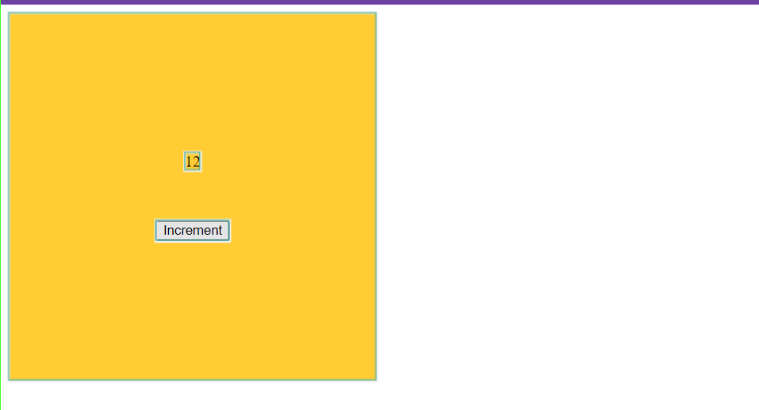

Week 7.2 | Context, State Management, Recoil

### Contents
- **Context API reacap**
- **State Management**
- **Recoil**

### Why do we use the Context API?
**Context API** is a powerful tool for managing state at the component level and facilitating the sharing of data between components without having to pass props through every level of the component tree. However, there are some limitations to the Context API that have led developers to explore other state management solutions. 
1. **Performance Concerns**:
    - **Context API Issue**: Changes in the context value trigger a re-render for all components subscribed to that context, regardless of whether they depend on the changed data.
    - **Alternative Solution**: Libraries like Redux, Recoil often use a more granular approach to state updates. Components can subscribe to specific parts of the state, reducing unnecessary renders.
2. **Complexity with Large Apps**:
    - **Context API Issue**: As an application grows, managing complex state logic solely with the Context API can become unwieldy.
    - **Alternative Solution**: Libraries like Redux provide a clear structure for managing global state. Actions, reducers, and middleware can help organize code and separate concerns in a scalable way.
3. **DevTools Support**:
    - **Context API Issue**: DevTools support for inspecting and debugging context-based state can be limited.
    - **Alternative Solution**: State management libraries like Redux often come with powerful DevTools that make it easier to trace state changes, inspect actions, and debug the application's state.

Here, an example show the issue with context API:
 ``` jsx
import { createContext } from 'react'

export const CountContext = createContext(0)
```
``` jsx
import { useContext, useState } from 'react'
import { CountContext } from './context'

const App = () => {
    const [count, setCount] = useState(0)
    return (
        <CountContext.Provider value={count}>
            <Count setCount={setCount} />
        </CountContext.Provider>
    )
}

const Count = ({ setCount }) => {
    return (
        <div
            style={{
                background: '#fc3',
                height: '50vh',
                width: '50vh',
                display: 'flex',
                flexDirection: 'column',
                gap: '50px',
                alignItems: 'center',
                justifyContent: 'center',
            }}>
            <CounterRenderer />
            <Button setCount={setCount} />
        </div>
    )
}

const CounterRenderer = () => {
    const count = useContext(CountContext)
    return <div> {count} </div>
}

const Button = ({ setCount }) => {
    return (
        <button type='button' onClick={() => setCount((prev) => prev + 1)}>
            {' '}
            Increment{' '}
        </button>
    )
}

export default App
```

Take a look at the image here we can see clearly that the Count component is getting re-rendered even if it does have any state inside it.

