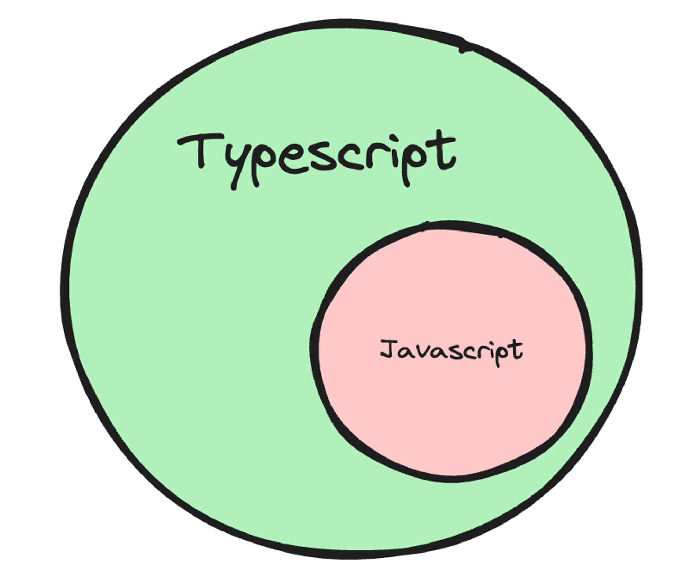

# Week 9.2 | Typescript

### Contents
- **Types of Languages (Strongly typed vs loosely typed)**
- **Typescript**
    - **What is Typescript?**
    - **Where/How does typescript code run?**
    - **Typescript compiler**
- **The TSC compiler**
- **Basic Types in Typescript**

### Types of Languages (Strongly typed vs loosely typed)
- The terms **strongly typed** and **loosely typed** refer to how programming languages handle types, particularly how strict they are about type conversions and type safety.

| Strongly Typed                            | Loosely Typed                             |
|-------------------------------------------|-------------------------------------------|
| Variables have a fixed type               | Variables can be change types             |
| Type checking is enforced at compile-time | Type checking is enforeced at runtime     |
| Stricter codebase                         | Faster to bootstrap                       |
| Lesser runtime errors                     | high chances for run time errors          |
| Examples: C++, Java, Rust                 | Examples: Javascript, Python, Perl, php   |

### Typescript
#### What is Typescript?
- Typescript is a programming language developed and maintained by Microsoft.
- It is a **strict syntactical superset** of JavaScript and adds optional static typing to the language.


#### Where/How does typescript code run?
- Typescript code never runs in your browser. Your browser can only understand javascript. 
- Javascript is the runtime language (the thing that actually runs in your browser/nodejs runtime).
- Typescript is something that compiles down to javascript/
- When typescript is compiled down to javascript, you get type checking (similar to C++). If there is an error, the conversion to Javascript fails.


#### Typescript compiler
- **tsc** is the official typescript compiler that you can use to convert Typescript code into Javascript.
- There are many other famous compilers/transpilers for converting Typescript to Javascript. Some famous ones are - 
    - **esbuild**
    - **swc**

### The tsc compiler
Let’s bootstrap a simple Typescript Node.js application locally on our machines.
1.  -**Install tsc/typescript globally**
```bash 
npm install -g typescript
```
2. **Initialize an empty Node.js project with typescript**
``` bash
mkdir node-app
```
- These commands should initialize two files in your project

3. **Create a a.ts file**
```typescript
const x: number = 1;
console.log(x);
```
4. **Compile the ts file to js file**
```bash
tsc -b
```
5. **Explore the newly generated index.js file**

- Notice how there is no typescript code in the javascript file. It’s a plain old js file with no **types**.
6. **Delete a.js**
7. **Try assigning x to a string**
- Make sure you convert the const to let
```typescript
let x: number = 1;
x = "harkirat"
console.log(x);
```
8. **Try compiling the code again**
```bash 
tsc -b
```
- Notice all the errors you see in the console. This tells you there are type errors in your codebase.
- Also notice that no **index.js** is created anymore.

- This is the high level benefit of typescript. It lets you catch **type** errors at **compile time**.


### Basic Types in Typescript
- Typescript provides us with some basic types:
    - **number**
    - **string**
    - **boolean**
    - **null**
    - **undefined**

#### Problem 1 - Hello World
- **Aim**: How to give types to arguments of a function
- **Problem**: Write a function that greets a user given their first name.
- **Argument**: firstName
- **logs**: Hello {firstName} 
- **returns**: Doesn't return anything

```typescript
function greeting(firstName: string) {
    console.log(`Hello ${firstName}`)
}

greeting('Anoop')
```
